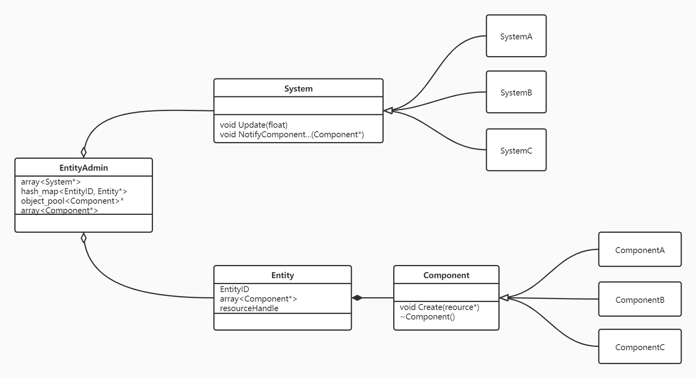

# Welcome to **xqfinxd**
Click [here](https://github.com/xqfinxd) to visit my github.

### useful websites

1. [cpp-reference-CN](https://zh.cppreference.com/)
2. [LearnOpenGL-CN](https://learnopengl-cn.github.io/)
3. [SDL2-wiki](http://wiki.libsdl.org/APIByCategory)

### of course [Markdown-Doc](https://markdown-zh.readthedocs.io/en/latest/)
--------
# Notebook
...
## Lanugage attribute
### ___std::forward and std::move___
__right value__ and __left value__. __left value__ can be in __both__ left and right side of '=', and __right value__ can __only__ be in right side of '='.

left value reference, a reference of a left value; right value reference, a reference binding in a right value. when right value reference as function paramet, it will be regarded as left value. that's to say reference is left value.

use __std::forward__ keep its value attribute, use __std::move__ transfer value attribute to right value.
``` cpp
#include <iostream>

void value_type(int& v) {
	std::cout << "left value" << std::endl;
}
void value_type(int&& v) {
	std::cout << "right value" << std::endl;
}
template<typename T>
void test(T&& v) {
	value_type(std::forward<T>(v));
}

int main(void) {
	int lv = 1;
	test(lv);
	int& lvr = lv;
	test(lvr);
	test(std::move(lvr/*or lv*/));
	test(100);
}
```

_output result_
``` result
left value
left value
right value
right value
```


### ___function object and thread___
``` cpp
struct MyStruct {
	int Foo(int loop, int x) {
		while (loop--) {
			std::cout << x << std::endl;
		}
		return loop + x;
	}
};

int main() 
{
	MyStruct sub;
    //member function as function object.
	std::function<int(MyStruct&, int, int)> member_func = &MyStruct::Foo;
    //member function as packaged_task object.
	std::packaged_task<int(MyStruct&, int, int)> task(&MyStruct::Foo);
    //std::bind is available.
    std::packaged_task<int(MyStruct&, int, int)> task(std::bind(&MyStruct::Foo, std::placeholders::_1, std::placeholders::_2, std::placeholders::_3));
    //use packaged_task.
    //Attention:call task in child thread use <std::move>.
	auto future = task.get_future();
	std::thread thread1(std::move(task), std::ref(sub), 2000, 1);
	std::cout << future.get() << std::endl;

    //or use function object without return code.
    std::thread thread2(member_func, std::ref(sub), 2000, 2);

    //call join or detach before program quit.
	thread1.join();
    thread2.join();
	return 0;
}
```
### ___mysql trap___
get data from mysql into local dir with redefine system.
``` sql
mysql -h <IP> -u <NAME> -p -P <PORT> <DATABASENAME> -Nsr -e "select <ATTRIBUTE> from <TABLENAME> where <CONDITION> and <CONDITION>;" >> target.ext
```
1. __-N__ specify that don't print table head.
2. __-s__ specify that don't print border line combinded with "+" and "-". like the follow.
```
+-------+
-   1   -
-   2   -
+-------+
```
3. __-r__ specify that don't transfer other format and keep native data.
4. __-p__ specify that using password but never give it the password.
5. __-e__ specify that run the string instead of shell.

...

## Project experience
### ___D ptr___
``` cpp
//*/Foo.h
//Foo.h define class Foo and declare class FooPrivateData. use FooPrivateData* represent containing it.
class FooPrivateData;
class Foo {
	FooPrivateData* data;
};
//*/Foo.cc
//Foo.cc include FooPrivateData.h, Foo.h and implement class Foo.
#include "Foo.h"
#include "FooPrivateData.h"
class Foo {
	//do something...
};
//*/Private/FooPrivateData.h
//FooPrivateData.h define and implement class FooPrivateData.
class FooPrivateData {
	//do something...
};
//*/Bar.h
//like the Foo.h.
class BarPrivateData;
class Bar {
	BarPrivateData* data;
};
//*/Bar.cc
//include FooPrivateData.h and BarPrivateData.h and use the private member for implement class Bar.
#include "Bar.h"
#include "BarPrivateData.h"
#include "FooPrivateData.h"
class Bar {
	//do something...
	//foo.data...
};
//*/Private/BarPrivateData.h
//like the BarPrivateData.h.
class BarPrivateData {
	//do something...
};
```
### ___windbg tool___
1. load dump file
2. load symbols files(pdb)
3. call __.reload__
4. call __.ecxr__
5. call __kv__


### ___ECS(Entity-Component-System)___

what's the 'object_pool<Component>'
like?
``` cpp
using object_pool = std::unique_ptr
//an array of object pool.
object_pool<Component>* pools = new object_pool<Component>[kMaxComponent];
//pool is an array of the same components.
pools[SomeComponentTypeID] = object_pool<SomeComponent>(new SomeComponent[kPoolSize]);
SomeComponent* components = static_cast<SomeComponent*>(pools[SomeComponentTypeID].get());
//...components ops
```

...
